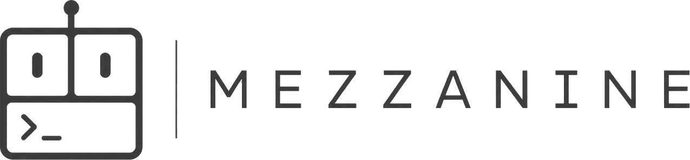
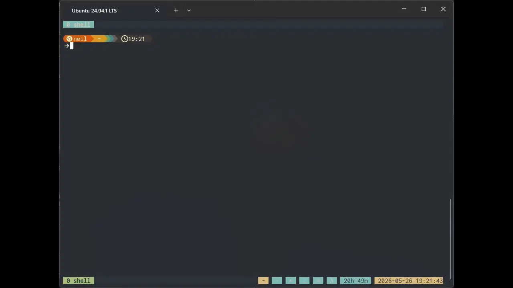

<div align="center">
<p align="center">
  <picture>
    <source
      srcset="./resources/mezzanine-combined-light.png"
      media="(prefers-color-scheme: dark)"
    />
    <source
      srcset="./resources/mezzanine-combined-dark.png"
      media="(prefers-color-scheme: light)"
    />
    
  </picture>
</p>
<p align="center">
  <a href="https://github.com/NFJones/mezzanine/stargazers"></a>
  <a href="https://github.com/NFJones/mezzanine/forks"></a>
  <a href="https://github.com/NFJones/mezzanine/issues"></a>
  <a href="https://github.com/NFJones/mezzanine/actions"></a>
</p>
</div>

***

<div align="center">
<picture>
    
</picture>
</div>

***

Mezzanine is a terminal multiplexer with a built-in pane-local agent. Use it
when you want to keep a shell, logs, editor, and agent conversation in one
recoverable session while you inspect, edit, and validate work.

Start here: [Why Mezzanine?](#why-mezzanine), [Prerequisites](#prerequisites),
and [Quick Start](#quick-start).
Look up common tasks: [Everyday Use](#everyday-use),
[Advanced Tasks](#advanced-tasks), [CLI Cheat Sheet](#cli-cheat-sheet), and
[Configuration Quick Reference](#configuration-quick-reference).
Go deeper: [Documentation Guide](#documentation-guide).
Contributing in this repository? See [Contributor Notes](#contributor-notes).

***

- [Why Mezzanine?](#why-mezzanine)
- [Prerequisites](#prerequisites)
- [Quick Start](#quick-start)
  - [1. Install `mez`](#1-install-mez)
  - [2. Create config and authenticate](#2-create-config-and-authenticate)
  - [3. Start Mezzanine inside a repository](#3-start-mezzanine-inside-a-repository)
  - [4. Open the agent shell in the focused pane](#4-open-the-agent-shell-in-the-focused-pane)
  - [5. Try a bounded first task](#5-try-a-bounded-first-task)
- [Everyday Use](#everyday-use)
  - [Start or attach to a session](#start-or-attach-to-a-session)
  - [Work in the multiplexer](#work-in-the-multiplexer)
  - [Use the agent shell](#use-the-agent-shell)
  - [Project context](#project-context)
- [Provider Support](#provider-support)
- [Agent Model and Safety](#agent-model-and-safety)
- [Advanced Tasks](#advanced-tasks)
  - [Debug a failing test in the current repository](#debug-a-failing-test-in-the-current-repository)
  - [Delegate a bounded investigation to subagents](#delegate-a-bounded-investigation-to-subagents)
  - [See approval and policy boundaries in practice](#see-approval-and-policy-boundaries-in-practice)
  - [Review a project overlay before trusting it](#review-a-project-overlay-before-trusting-it)
- [What Persists Across the Session](#what-persists-across-the-session)
- [CLI Cheat Sheet](#cli-cheat-sheet)
  - [Common global flags](#common-global-flags)
  - [Session commands](#session-commands)
  - [Configuration and trust commands](#configuration-and-trust-commands)
  - [Auth and integration commands](#auth-and-integration-commands)
- [Configuration Quick Reference](#configuration-quick-reference)
- [Documentation Guide](#documentation-guide)
- [FAQ](#faq)
  - [Does the agent automatically see my terminal screen?](#does-the-agent-automatically-see-my-terminal-screen)
  - [Where should API keys go?](#where-should-api-keys-go)
  - [Can I configure a different shell executable?](#can-i-configure-a-different-shell-executable)
  - [How do project instructions work?](#how-do-project-instructions-work)
  - [How do project config overlays become trusted?](#how-do-project-config-overlays-become-trusted)
  - [What happens when a command needs approval?](#what-happens-when-a-command-needs-approval)
  - [Can I use more than one agent at once?](#can-i-use-more-than-one-agent-at-once)
  - [How do I run Mezzanine for automation?](#how-do-i-run-mezzanine-for-automation)
- [Contributor Notes](#contributor-notes)

## Why Mezzanine?

Mezzanine is for terminal-first development when you want project-local
context, persistent sessions, and agent help without splitting the work across
multiple tools.

It is most useful when you want all of the following in one tool:

- **Persistent terminal sessions** with windows, panes, detach, reattach, and
  copy mode.
- **Pane-local agent context** so one pane can debug a test while another stays
  on logs, a shell, or an editor.
- **Agent help in the shell environments you use** including local
  shells, containers, SSH sessions, and other command environments already open
  in a pane.
- **Explicit, reviewable actions** for shell commands, patches, approvals, MCP,
  and subagent work.
- **Built-in approval and policy controls** for shell, network, destructive,
  and other actions.
- **Conversation and session state** that survive prompt hide/show, client
  detach, and session reattach.

If you mainly want a traditional shell multiplexer, use Mezzanine as a
multiplexer. If you mainly want a coding agent, open the agent shell in the
pane where the work already lives. Then, jump back into the shell to inspect
the agent's work for yourself.

## Prerequisites

Before the first command, make sure you have:

- A Unix-like operating system with pseudoterminals and POSIX-style shells.
- A Rust 2024 toolchain if you are building from source.
- A usable `$SHELL`; otherwise Mezzanine falls back to `/bin/sh` when it is
  executable.
- Provider credentials for model-backed agent work. The generated defaults use
  the built-in OpenAI provider profile.
- A repository or other working directory you want to operate on. A repository
  gives the best first-run experience.

## Quick Start

Use this path on a clean machine.

### 1. Install `mez`

```sh
cargo install --path . --locked
```

This installs `mez` into Cargo's bin directory, typically `~/.cargo/bin`. If
that directory is not already on your `PATH`, run `~/.cargo/bin/mez` in the
steps below.

### 2. Create config and authenticate

```sh
mez config init
mez auth login
```

Existing primary config files are migrated on launch to the current schema
version before Mezzanine validates them. Newer config schema versions than the
running binary understands are rejected.

If you are using an API key instead of browser auth:

```sh
mez auth login --api-key
```

### 3. Start Mezzanine inside a repository

```sh
cd /path/to/repository
mez
```

On first launch you should see a Mezzanine session with a focused pane running
in that repository. If you want to leave the session, press `Ctrl+A d` to
detach or close the client normally.

### 4. Open the agent shell in the focused pane

Press `Ctrl+A a`.

The prompt is pane-local, so your other panes and normal multiplexer navigation
still work while the agent shell is open.

### 5. Try a bounded first task

Ask the pane agent for one small repo-local task such as:

> Read this crate, find the most relevant failing or risky area, explain it
> briefly, then propose the smallest safe fix.
> Start with a task that mostly needs local reads and, at most, one or two
> focused commands.

## Everyday Use

Use this section when you already know the basics and want the common paths in
one place.

### Start or attach to a session

```sh
mez          # default session behavior
mez new      # create a new session
mez list     # list resumable sessions
mez attach   # attach to a resumable session
```

Foreground service mode is available when you want a daemon without
immediately attaching a primary client:

```sh
mez serve
mez attach SESSION_ID
```

Use `-S <socket-path>` to select an explicit control socket or `-L <name>` to
select a named socket under the runtime directory. Add `--json` to CLI commands
when scripting.

### Work in the multiplexer

Default workflow keys follow conventional multiplexer placement:

| Key                         | Action                                 |
| --------------------------- | -------------------------------------- |
| `Ctrl+A :`                  | Open the Mezzanine command prompt.     |
| `Ctrl+A ?`                  | List key bindings.                     |
| `Ctrl+A d`                  | Detach the primary client.             |
| `Ctrl+A c`                  | Create a window.                       |
| `Ctrl+A %`                  | Split vertically.                      |
| `Ctrl+A "`                  | Split horizontally.                    |
| `Ctrl+A Up/Down/Left/Right` | Focus a pane by direction.             |
| `Ctrl+A n` / `Ctrl+A p`     | Next or previous window.               |
| `Ctrl+A [`                  | Enter copy mode.                       |
| `Ctrl+A ]`                  | Paste the latest buffer.               |
| `Ctrl+A a`                  | Toggle the focused pane's agent shell. |
| `Ctrl+A C`                  | Create a new window group.             |
| `Ctrl+A (` / `Ctrl+A )`     | Previous or next group.                |

With mouse support enabled, dragging selects pane text and double-clicking
copies the surrounding readline-style word into the `mouse` paste buffer and
host clipboard when clipboard integration is available.

The Mezzanine command prompt accepts commands such as `new-window`,
`split-window`, `select-pane`, `set-theme`, `list-keys`, `show-options`, and
`refresh-provider-info`. Commands entered there are parsed by Mezzanine, not by
the pane shell.

Command output shown in the pager supports `/` text search. Submit a query to
jump to the next match; submit `/` with an empty query to repeat the last search,
wrapping to the top when no later match exists.

### Use the agent shell

Press `Ctrl+A a` in a pane and type a request. The agent works from the focused
pane's working directory, conversation state, and runtime settings.

Agent-mode logs and rendered transcript entries wrap to the active pane width,
capped at 120 display columns, so persisted and replayed transcript rows remain
bounded on wide terminals.

Useful slash commands include:

| Command        | Purpose                                               |
| -------------- | ----------------------------------------------------- |
| `/help`        | Show agent shell help.                                |
| `/status`      | Show the current pane agent session.                  |
| `/model`       | Inspect or change model selection.                    |
| `/thinking`    | Toggle provider thinking mode when supported.         |
| `/approval`    | Inspect or change approval mode.                      |
| `/permissions` | Inspect or change permission policy.                  |
| `/list-skills` | Show the skills available to the active pane.         |
| `/list-mcp`    | List configured MCP tools.                            |
| `/log-level`   | Show or set `normal`, `verbose`, `debug`, or `trace`. |
| `/stop`        | Interrupt the active turn.                            |
| `/new`         | Start a fresh conversation for the pane.              |
| `/resume`      | Resume a saved conversation.                          |
| `/compact`     | Compact conversation context.                         |
| `/exit`        | Hide the agent shell.                                 |

Normal logging shows prompts, assistant text, concise progress, approvals,
errors, command summaries, and final responses. Higher log levels are mainly
for debugging.

Mezzanine has three operator-facing command surfaces:

- terminal commands entered through the Mezzanine command prompt,
- pane-local slash commands entered in the agent shell, and
- explicit skills invoked with `$<skill-name> [additional context]`.

See [docs/agent-skills-and-commands.md](docs/agent-skills-and-commands.md) for
the command-surface breakdown, explicit skill syntax, and built-in skill usage.

### Project context

- Put project-specific agent instructions in `AGENTS.md`.
- Put project config overlays under `.mezzanine/config.toml` when needed.
- Project overlays are trusted per project root. Until trusted, behavior that
  depends on the overlay is blocked or skipped with diagnostics.
- Inspect trust state with `mez config trust list`; trust, reject, or revoke
  project roots through `mez config trust ...`.
## Provider Support
Mezzanine currently ships with native support for a small provider set. The table below summarizes the
currently supported providers and the provider families that should eventually
be supported.

Abstract feature labels in the table mean:
- **Streaming**: incremental token or event streaming during a turn.
- **Tools**: provider support for Mezzanine MAAP tool/function calls.
- **Structured output**: schema-shaped or otherwise strongly structured model
  responses.
- **Reasoning controls**: explicit thinking or reasoning-effort controls.
- **Catalog refresh**: explicit runtime model-list discovery or refresh.

| Provider / family   | Status      | API shape                                                                    | Streaming | Tools | Structured output | Reasoning controls | Catalog refresh |
| ------------------- | ----------- | ---------------------------------------------------------------------------- | --------- | ----- | ----------------- | ------------------ | --------------- |
| OpenAI              | Supported   | Native Responses API                                                         | Yes       | Yes   | Yes               | Partial            | Yes             |
| Generic OpenAI API  | Supported   | OpenAI-compatible Chat Completions API                                        | No        | Yes   | Partial           | No                 | Partial         |
| DeepSeek            | Supported   | Native Chat Completions API                                                  | Partial   | Yes   | Partial           | Yes                | Partial         |
| Anthropic           | Unsupported | Native Messages API                                                          |           |       |                   |                    |                 |
| Gemini direct API   | Unsupported | OpenAI-compatible first, native later if needed                              |           |       |                   |                    |                 |
| Mistral             | Unsupported | OpenAI-compatible or native API                                              |           |       |                   |                    |                 |
| Perplexity          | Unsupported | Native API or compatibility path to be determined                            |           |       |                   |                    |                 |
| xAI                 | Unsupported | Responses-compatible hosted API                                              |           |       |                   |                    |                 |
| Bedrock / Vertex AI | Unsupported | Cloud deployment backends over multiple provider families                    |           |       |                   |                    |                 |
| Cohere              | Unsupported | Native or compatibility path to be determined                                |           |       |                   |                    |                 |

Current support reflects behavior implemented in the repository today.

## Agent Model and Safety

- The agent can read repo files, run bounded shell commands, apply patches,
  call configured MCP tools, and delegate scoped work to subagents.
- The agent is pane-local: it works from the focused pane rather than from a
  hidden global view of your terminal.
- The agent does not passively receive your full screen, scrollback, or other
  panes by default. It sees explicit prompts, configured instructions,
  conversation context, and explicit action results.
- Shell, network, destructive, configuration, and some MCP actions may require
  approval depending on the active runtime mode.
- Actions can be logged, approved, denied, or interrupted.

## Advanced Tasks

### Debug a failing test in the current repository

1. Start or attach to a Mezzanine session in the repo.
2. Press `Ctrl+A a` in the pane that already has the repo working directory.
3. Ask:
   > Run the smallest relevant test target, explain the failure, fix it with
   > the smallest coherent patch, and rerun the check.

### Delegate a bounded investigation to subagents

1. Open the agent shell in the pane where the repo already lives.
2. Ask for a split task such as:
   > Inspect this regression and delegate targeted read-only investigation to
   > subagents for the scheduler and runtime paths. Summarize the findings and
   > recommend the smallest safe fix.
3. Review any additional panes or windows created for delegated work and the
   final parent-agent summary.

### See approval and policy boundaries in practice

1. Start a session in a repository and open the agent shell with `Ctrl+A a`.
2. Ask for a task that needs execution, for example:
   > Run the smallest relevant test command, explain the result, and propose a
   > patch if needed.
3. When approval is required, review the requested action in the primary
   client before allowing or denying it.
   Approval requests appear in the primary client before the action runs.

### Review a project overlay before trusting it

1. Open the project in a pane.
2. Inspect pending trust state:
   ```sh
   mez config trust list
   ```
3. Review `.mezzanine/config.toml` and `AGENTS.md`.
4. Trust the project root only after you understand the additional authority it
   requests.

## What Persists Across the Session

- Session layout, windows, panes, and pane history persist according to the
  active session and history settings.
- Pane-local agent conversation state can survive prompt hide/show, detach, and
  reattach flows.
- Live agent settings such as the selected model, approval mode, and log level
  can remain associated with the pane agent session.
- Project trust decisions and persisted configuration changes remain in the
  relevant config or trust store, not just the live client process.
- Persisted state does not bypass approval or trust checks.

## CLI Cheat Sheet

```text
mez [--json] <command> [options]
```

### Common global flags

| Flag               | Purpose                                            |
| ------------------ | -------------------------------------------------- |
| `--json`           | Machine-readable output for scripting.             |
| `-S <socket-path>` | Target an explicit control socket.                 |
| `-L <name>`        | Target a named socket under the runtime directory. |

### Session commands

| Command                    | Purpose                                                    |
| -------------------------- | ---------------------------------------------------------- |
| `mez`                      | Start or attach using the default session behavior.        |
| `mez new`                  | Create a new session.                                      |
| `mez list`                 | List resumable sessions.                                   |
| `mez attach [SESSION_ID]`  | Attach to a resumable session.                             |
| `mez detach`               | Detach the current or specified client.                    |
| `mez kill-session --force` | Terminate a live session.                                  |
| `mez serve`                | Start a foreground control daemon for a new session.       |
| `mez snapshot ...`         | Create, list, inspect, delete, resume, and plan snapshots. |

### Configuration and trust commands

| Command                     | Purpose                                    |
| --------------------------- | ------------------------------------------ |
| `mez config init`           | Create a starter config.                   |
| `mez config path`           | Show the active config path.               |
| `mez config validate`       | Validate the current configuration.        |
| `mez config get [PATH]`     | Show effective config values.              |
| `mez config default`        | Print the built-in default config.         |
| `mez config layers`         | Show loaded config layers and diagnostics. |
| `mez config set PATH VALUE` | Persist a scalar value.                    |
| `mez config unset PATH`     | Remove a persisted scalar value.           |
| `mez config trust list`     | Inspect project trust records.             |

### Auth and integration commands

| Command                    | Purpose                                                         |
| -------------------------- | --------------------------------------------------------------- |
| `mez auth login`           | Authenticate with the active provider.                          |
| `mez auth login --api-key` | Authenticate with an API key.                                   |
| `mez auth status`          | Show auth state.                                                |
| `mez auth logout`          | Remove stored auth for the active profile.                      |
| `mez mcp ...`              | List, add, remove, enable, disable, inspect, login, logout, and status MCP servers. |
| `mez memory ...`           | List, add, inspect, edit, delete, and export persistent memory. |

## Configuration Quick Reference

Use the dedicated reference for generated defaults, supported fields, and layer
behavior:

- [Configuration reference](docs/configuration-reference.md)
- [Example config](docs/examples/config.toml)
- [SPEC.md Section 8](SPEC.md#8-configuration)

Common tasks:

| Task                              | Command or path                    |
| --------------------------------- | ---------------------------------- |
| Create a starter config           | `mez config init`                  |
| Validate the current config       | `mez config validate`              |
| Inspect the effective config      | `mez config get`                   |
| Show the built-in defaults        | `mez config default`               |
| Change the active theme           | `mez config set theme.active nord` |
| Inspect trust state               | `mez config trust list`            |
| Trust a project root              | `mez config trust trust PATH`      |
| Change model selection at runtime | `/model`                           |
| Toggle supported thinking mode    | `/thinking`                        |
| Change approval mode at runtime   | `/approval`                        |

Credentials belong in `mez auth`, not in config files.

## Documentation Guide

- [docs/README.md](docs/README.md): documentation map by audience and task.
- [docs/agent-skills-and-commands.md](docs/agent-skills-and-commands.md):
  terminal commands, slash commands, and explicit skills.
- [docs/configuration-reference.md](docs/configuration-reference.md): exact
  configuration fields, defaults, and layer behavior.
- [docs/examples/config.toml](docs/examples/config.toml): generated baseline
  configuration example.

## FAQ

For quick command lookup, start with [CLI Cheat Sheet](#cli-cheat-sheet) and
[Configuration Quick Reference](#configuration-quick-reference).

### Does the agent automatically see my terminal screen?

No. Default model context excludes passive visible screen contents, scrollback,
and alternate-screen contents. The model sees explicit user prompts,
configured instructions, prior conversation context, and explicit action
results.

### Where should API keys go?

Use `mez auth login`. Do not put tokens, API keys, bearer tokens, or other
secret material in config files.

### Can I configure a different shell executable?

No. Mezzanine resolves the shell from `$SHELL` when it is absolute and
executable, otherwise from `/bin/sh`. Config may adjust shell mode and
environment, but not the executable path.

### How do project instructions work?

By default Mezzanine discovers `AGENTS.md` from the project context and includes
it in provider requests. The discovery filenames are configurable under
`instructions.project_filenames`.

### How do project config overlays become trusted?

Project overlays are discovered from the project root and remain pending until
the primary client trusts or rejects them. Use `mez config trust list` to see
records and `mez config trust trust PATH` to trust a root.

### What happens when a command needs approval?

The runtime routes approval to the primary client according to the active
permission policy. Read-only observers cannot approve, mutate config, or send
pane input.

### Can I use more than one agent at once?

Yes. Agents are pane-scoped, so you can open agent shells in different panes
for separate tasks. Mezzanine can also spawn subagents for delegated work,
subject to the configured depth, placement, and concurrency limits.

### How do I run Mezzanine for automation?

Use `mez serve` to start a foreground service, then target it with `mez -S
<socket>` or `mez -L <name>`. Add `--json` for machine-readable output.

## Contributor Notes

Use the repository `justfile`:

```sh
just check
just fmt
just clippy
just test
```

`just fmt`, `just clippy`, and `just test` are the expected pre-handoff checks
for repository changes.
