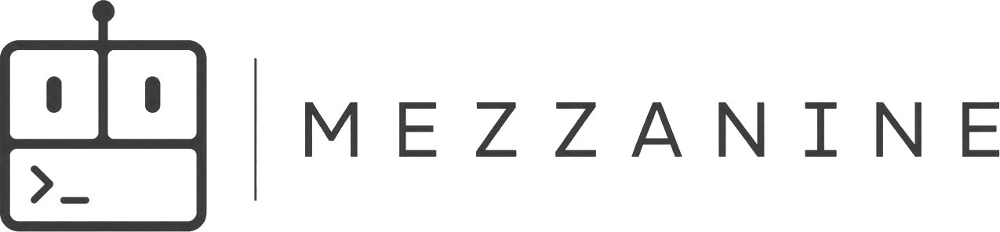
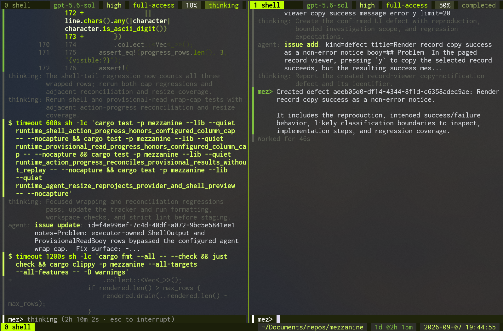

<div align="center">
<p align="center">
  <picture>
    <source
      srcset="./resources/mezzanine-combined-light.png"
      media="(prefers-color-scheme: dark)"
    />
    <source
      srcset="./resources/mezzanine-combined-dark.png"
      media="(prefers-color-scheme: light)"
    />
    
  </picture>
</p>
<p align="center">
  <a href="https://github.com/NFJones/mezzanine/stargazers"></a>
  <a href="https://github.com/NFJones/mezzanine/forks"></a>
  <a href="https://github.com/NFJones/mezzanine/issues"></a>
  <a href="https://github.com/NFJones/mezzanine/actions"></a>
  <a href="https://deepwiki.com/NFJones/mezzanine"></a>
</p>
</div>

***

<div align="center">
<picture>
    
</picture>
</div>

***

Mezzanine is a terminal multiplexer with a built-in pane-local agent. Keep a
shell, logs, editor, and agent conversation together in one recoverable session
while you inspect, edit, and validate work.

## Why Mezzanine?

- **Persistent sessions:** windows, panes, detach/reattach, and copy mode.
- **Pane-local agents:** independent conversations beside the shell where work
  already lives.
- **Reviewable actions:** visible shell commands, patches, approvals, MCP calls,
  and subagent work.
- **Safety controls:** approval policy, project trust, and optional OS-level
  confinement are distinct, visible controls.

## Prerequisites

- A Unix-like system with pseudoterminals and a POSIX-style shell.
- A Rust 2024 toolchain when building from this repository.
- A usable `$SHELL`; Mez falls back to `/bin/sh` when it is executable.
- A provider account and supported sign-in method for model-backed agent work.

## Quick start

Install the product package:

```sh
cargo install --path crates/mezzanine --locked
```

From a checkout of this repository, optionally create and inspect the baseline
configuration before authenticating and starting in a working directory.
Starting a session also creates the default configuration when none exists:

```sh
mez config init
mez auth login
cd /path/to/repository
mez
```

The default interactive `mez auth login` flow opens OpenAI's browser sign-in.
Choose an explicit provider and credential method when using another provider,
an API key, or noninteractive authentication; [Getting started](docs/getting-started/README.md)
documents those flows.

Press `Ctrl+A a` to open the focused pane's agent shell. Begin with a bounded
task that asks for inspection and focused validation. Press `Ctrl+A d` to detach
without normally stopping the session.

For a complete first-session guide, including API-key and noninteractive
authentication, see [Getting started](docs/getting-started/README.md).

## Everyday use

Use `mez new` to create a new session, `mez list` to discover resumable sessions,
and `mez attach` to return to one. In a running session, `Ctrl+A :` opens the
Mezzanine command prompt, `Ctrl+A ?` shows effective key bindings, and
`Ctrl+A a` toggles the agent shell.

Use `mez --help` and the [CLI reference](docs/reference-manual/cli.md) for the
current command contract. Use [Sessions and panes](docs/using-mezzanine/sessions-and-panes.md)
and [Terminal input, copy, and history](docs/using-mezzanine/terminal-input-copy-and-history.md)
for in-session work.

## Safety at a glance

The agent works from its pane's working directory, configured guidance, and
explicit action results. It does not passively receive your terminal screen,
scrollback, or other panes.

Approval policy decides whether Mezzanine permits an action. OS confinement
controls what an already-permitted local shell process can access.
`policy-only` provides no filesystem or shell-network confinement; approval
policy and optional audit logging remain separate controls. Bubblewrap enforces
configured boundaries. `host-access` runs
local shell actions outside the sandbox and is reserved for the primary user.

Review unfamiliar project overlays before trusting them, and review applicable
`AGENTS.md` files before acting on their guidance. Project instructions can
shape workflow but cannot grant authority; overlay trust is a separate decision.
See [Safety, trust, and security](docs/safety-and-trust/README.md) for approval,
sandbox, project-trust, and audit guidance.

## Documentation

The [Mezzanine manual](docs/README.md) is organized by task and audience:

- [Getting started](docs/getting-started/README.md)
- [Using Mezzanine](docs/using-mezzanine/README.md)
- [Agent and integrations](docs/agent/README.md)
- [Safety, trust, and security](docs/safety-and-trust/README.md)
- [Configuration](docs/configuration/README.md)
- [Operations and troubleshooting](docs/operations/README.md)
- [CLI, key, action, and terminal reference](docs/reference-manual/README.md)
- [Contributor documentation](docs/contributing/README.md)

[SPEC.md](SPEC.md) remains the normative behavior and compatibility contract.
[AGENTS.md](AGENTS.md) contains repository workflow requirements for contributors.
